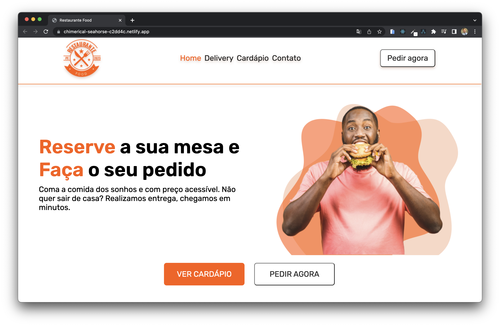

## Projeto Restaurante Food 🧑🏼‍🍳🍴

----

---
📝 Proposta: Reproduzir uma landing page de um restaurante com seções para pratos, cardápio, promoções, feedbacks, funcionários, contatos e newsletter. Acompanhando um protótipo desenvolvido pelo design [Jonas Nunes](https://www.linkedin.com/in/jonas-nunes-a30b57138/) atráves do figma.

----
#### Navegue aqui 🧑🏼‍🍳 [Restaurante Food](https://food-restaurante-vn.netlify.app/) ✅
----

### 💡 Conhecimentos aplicados:
- Design de interface
- Desenvolvimento web (HTML, CSS e JavaScript)
- Responsividade 📱
- UX (User Experience)
- Animações com a lib AOS
---
### 🔗 Linkedin [@vitornogueira](https://www.linkedin.com/in/vitor-noqueira-dev/) ✅
---
